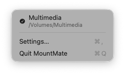
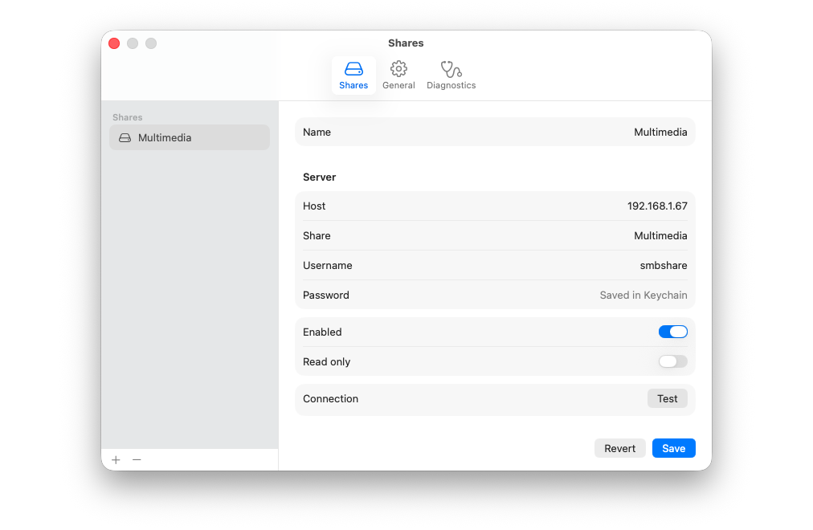
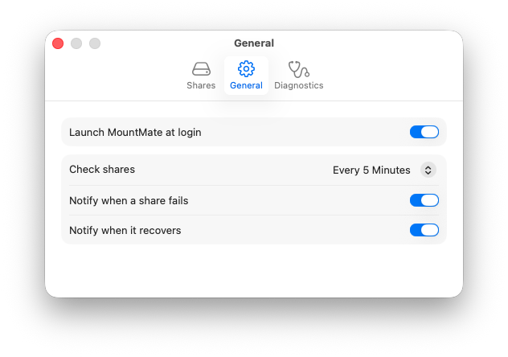
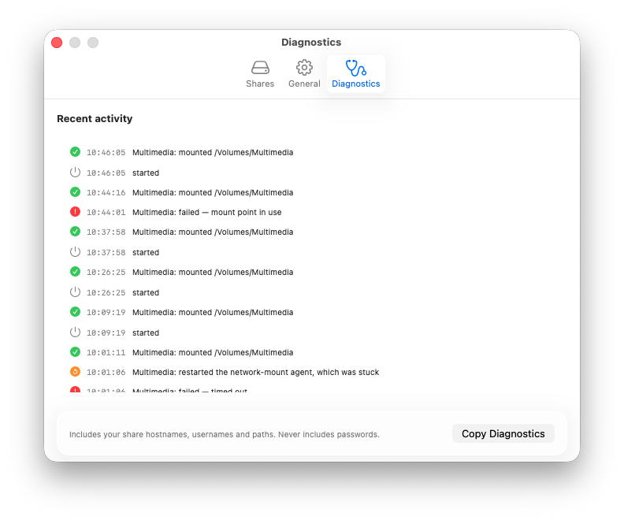

<p align="center">
  
</p>

<h1 align="center">MountMate</h1>

<p align="center">
  A menu bar app that keeps your Mac's network shares mounted, and tells you plainly when it can't.
</p>

<p align="center">
  <picture>
    <source media="(prefers-color-scheme: dark)" srcset="docs/images/menu.png">
    
  </picture>
</p>

## Why it exists

The usual ways to keep a NAS share mounted on a Mac, such as a login item or a script
that runs AppleScript's `mount volume` every minute, work until the first failure.
Then macOS shows an authentication dialog and waits for someone to click it. On a Mac
nobody is sitting at, like a media server or a home hub, the share stays down until a
person walks up to the screen. Meanwhile the script can't retry, because it is still
waiting on that dialog.

MountMate mounts through the same system framework with its dialogs switched off, so
a failure is reported instead of left waiting on screen. It retries on its own,
notices mounts that have quietly died, and tells you what went wrong in the menu, in
a notification and in a log.

## Features

- **Keeps shares mounted.** Reconnects after a network change or wake from sleep,
  and checks every share on a regular interval that you choose.
- **Never waits on a dialog.** Every mount runs with macOS's authentication UI
  disabled and a deadline, so nothing can block the next attempt.
- **Notices dead mounts.** A share that is still listed but has stopped responding
  is unmounted and mounted again.
- **Recovers macOS's network-mount agent** when it gets stuck, which otherwise holds
  up every network mount on the Mac until it is restarted by hand.
- **Mounts where you expect.** If `/Volumes/Multimedia` is taken, macOS quietly
  mounts at `/Volumes/Multimedia-1`, and anything configured against the usual path
  finds nothing there. MountMate refuses that, tells you what is in the way and how to
  clear it.
- **Keeps passwords in the Keychain,** never in its settings file or anywhere a
  process listing could show them.
- **Notifies you** when a share stays down, and again when it comes back.
- **Shows its work.** An activity log of every change, and a one-click report for
  troubleshooting that never includes passwords.
- **Launches at login** and stays out of the Dock.

## Screenshots

<p align="center">
  <picture>
    <source media="(prefers-color-scheme: dark)" srcset="docs/images/shares.png">
    
  </picture>
</p>

<p align="center">
  <picture>
    <source media="(prefers-color-scheme: dark)" srcset="docs/images/general.png">
    
  </picture>
  <picture>
    <source media="(prefers-color-scheme: dark)" srcset="docs/images/diagnostics.png">
    
  </picture>
</p>

## Requirements

- **macOS 26** or later, on Apple silicon or Intel.
- An **SMB** file share, such as one on a NAS.

## Install

There are two ways to install MountMate. Downloading it needs nothing else.
Building it yourself takes one command, and afterwards macOS leaves it alone.

| | Download | Build with one command |
|---|---|---|
| Needs | Nothing | Xcode 26 or its command line tools |
| First launch | Allowed once in System Settings, for each version | Opens normally |
| After an update | macOS asks for your login password once | No prompt, with an Apple ID in Xcode |

### Download

1. Download [**MountMate.zip**](https://github.com/ee02217/MountMate/releases/latest/download/MountMate.zip)
   and open it.
2. Drag **MountMate** into **Applications**, and open it from there.
3. macOS says it can't verify MountMate, because it isn't notarized by Apple.
   Notarizing needs a paid Apple developer membership. Click **Done**.
4. Open **System Settings → Privacy & Security**, scroll down to **Security**, click
   **Open Anyway** next to the message about MountMate, and confirm.

To update, download the new version and replace the app in Applications. Steps 3 and
4 come back once for each new version. The first time a new version reads a saved
share password, macOS asks for your login password: click **Always Allow**.

### Build with one command

In Terminal:

```bash
/bin/bash -c "$(curl -fsSL https://raw.githubusercontent.com/ee02217/MountMate/main/Scripts/bootstrap.sh)"
```

It builds the latest release on your Mac, installs it in `/Applications` and opens
it. If the command line tools are missing, it opens their installer; run the command
again once they have installed. Run it again any time to update.

An app built on your own Mac opens without a warning. If you have Xcode, sign in to
it with an Apple ID first (Xcode → Settings → Accounts). It's free, and it gives
your builds an *Apple Development* signing identity, so macOS never asks for your
login password after an update either. Without one, the script creates a
self-signed identity instead, and macOS asks once after each update.
[Why](docs/how-it-works.md#passwords-and-the-keychain).

### Then

Open **Settings → General** and turn on **Launch MountMate at login**. Updates keep
the login item working.

## Using MountMate

**The menu** lists each share with its status:

| Symbol | Meaning |
|---|---|
| ✓ | Mounted and responding |
| ! | Failed; the reason appears in the menu and in Diagnostics |
| ○ | Off: you unmounted it, so MountMate is leaving it alone |
| ↻ | Mounting now |

Click a share to unmount it. MountMate then stops keeping it mounted until you click
it again, so an unmount stays unmounted. ⌥-click a share to open it in Finder.

**Settings → Shares** is where you add (**+**) and remove (**−**) shares. For each
one, give the server's **Host**, the **Share** name and a **Username** and
**Password**. The password goes straight into the Keychain. Press **Test** to try a
real connection before saving.

**Settings → General** covers launch at login, how often to check every share, and
which notifications you want.

**Settings → Diagnostics** shows recent activity. **Copy Diagnostics** puts a report
on the clipboard for troubleshooting. It includes host names, user names and paths,
never passwords.

## Troubleshooting

**A share won't mount.** Open Diagnostics; the red line explains why. Press **Test**
in Settings → Shares for an immediate answer.

**"Mount point in use."** Something already occupies the share's folder in
`/Volumes`: a disk with the same name, or an empty folder left behind by an earlier
mount. Eject the disk, or remove the folder:

```bash
sudo rmdir /Volumes/<share name>
```

**macOS asks for your login password after an update.** That's expected for the
download, and for builds not signed with a developer team. Click **Always Allow** and
it won't ask again until the next update. To stop it altogether, sign in to Xcode
with an Apple ID and install with the one-line command.

**A mount is stuck or times out.** If the server still accepts connections, MountMate
restarts macOS's network-mount agent itself, at most once every five minutes, and
logs it as *restarted the network-mount agent*. To see every decision it made:

```bash
log show --predicate 'subsystem == "com.sergio.mountmate" AND category == "recovery"'
```

**Where things are kept:**

| | |
|---|---|
| Shares | `~/Library/Application Support/com.sergio.mountmate/endpoints.json` |
| Activity log | `~/Library/Application Support/com.sergio.mountmate/activity.log` |
| Passwords | Login Keychain, service `com.sergio.mountmate` |

`endpoints.json` is meant to be readable and editable. One option exists only there:
to mount a share in your own folder instead of `/Volumes`, set its `mountPolicy` to
`{ "custom": { "path": "/Users/you/mnt/media" } }`. If the file ever can't be read,
MountMate keeps a copy rather than overwriting it, and says so in Diagnostics.

## Development

```bash
swift build                    # build
swift test                     # run the tests
./Scripts/dev-bundle.sh        # a runnable debug copy in .build/MountMate.app
./Scripts/install.sh --open    # build, sign and install in /Applications, then open
swift Scripts/make-icon.swift  # redraw the app icon
```

`install.sh` signs with your Apple Development identity if you have one. Otherwise
create a self-signed identity once with `./Scripts/create-identity.sh`.

To publish a release, run `./Scripts/release.sh 1.2.0` from an up-to-date `main`.
It tags the version and attaches a signed, universal `MountMate.zip` to a GitHub
release; `--dry-run` builds the zip without publishing anything.

The app is a thin SwiftUI layer over `MountMateCore`, which holds the mounting,
retry and recovery logic, and is where the tests are. See
[How it works](docs/how-it-works.md) for the design.

## License

MIT. See [LICENSE](LICENSE).
